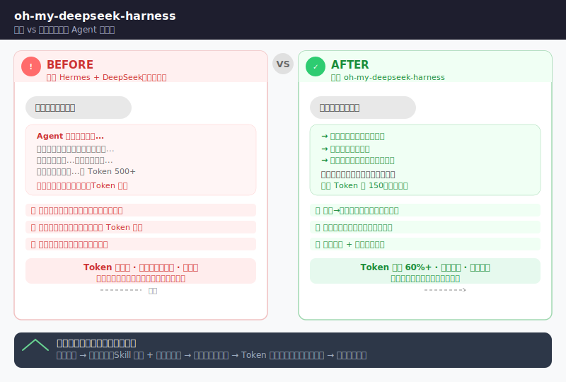

# oh-my-deepseek-harness ⚡

你的 Hermes Agent + DeepSeek 满血插件。一条命令安装，零配置开用。

[English](README_EN.md) | 简体中文

[](LICENSE)
[](https://python.org)
[](https://github.com/HermesAgent/hermes)
[](tests/)
[](https://github.com/yuanchenglu/oh-my-deepseek-harness)

<div align="center">
  
</div>

```bash
git clone https://github.com/yuanchenglu/oh-my-deepseek-harness.git
cd oh-my-deepseek-harness
bash scripts/install.sh
```

> ⭐ 觉得有用？点个 Star，让更多人发现 DeepSeek + Agent 的正确打开方式。

安装脚本会自动完成：备份已有记忆 → 创建插件软链接 → 注册 Hook → 安装依赖。安全无副作用，`install.sh --dry-run` 可预览。

---

## 你遇到的这些问题，装了就解决

你用 Hermes Agent 搭配 DeepSeek 时是不是总有这些感觉？

- Agent 不论任务大小都启动深度推理——简单的代码重构也要烧 500+ Token
- 对话越聊越卡，上下文窗口很快就满了，得手动清
- Agent 偶尔跑偏，说了不该说的话，做了不该做的操作
- 想用 DeepSeek V4 的那些新能力（推理强度控制、DSML 格式等），但不知道从哪下手
- 每次配新环境都要重新踩一遍坑，没有一个标准方案

**这个项目就是答案。**

oh-my-deepseek-harness 是目前**唯一**专门针对 DeepSeek V4 API 做了全链 Agent 优化的开源项目。它不修改一行 Hermes 核心代码，全部通过官方 Plugin Hook 接口注入，Hermes 每日更新也不会有冲突。

同类项目？没有。这块是空白。

---

## 三个你必须装的理由

### 1. 认知门控 + 约束免疫 — Agent 不再"乱来"

每轮对话自动注入三层认知架构：
- **L1 荣辱观**：告诉 Agent 什么事情该做、什么事情绝对不碰
- **L2 思维方式**：面对不同类型的问题应该用什么思维框架
- **L3 排除清单**：当前对话"不做什么"，避免分心跑偏

同时系统会自动检测你下的"不能/不要"类约束，记录违反日志，每天自动审计出报告。这个机制叫"约束免疫系统"——你的规则一旦定下来，Agent 会一直记得。

### 2. 意图→推理强度自动路由 — 该省省该花花

DeepSeek 的推理强度控制是个好能力，但问题是**每次都要手动指定**。装了这个插件后：

| 你的任务类型 | 插件自动做的事 | 效果 |
|------------|--------------|------|
| 简单对话 / 日常操作 | 匹配低推理强度 | 省 Token，响应快 |
| 重构 / 中等复杂度 | 匹配中等推理强度 | 够用不浪费 |
| 架构分析 / 研究 / 协作 | 匹配高推理强度 | 深度推理保质量 |

由 I-10 意图路由引擎自动识别你的每次输入属于 7+1 种意图之一，然后动态绑定对应的推理策略。你不需做任何事，Agent 自己知道什么时候该深思、什么时候该秒回。

### 3. 飞轮效应 — 用得越多，它越好用

大多数工具装上的那一刻就是巅峰，但这个插件刚好反过来：

```
用得越多 → 它越懂你（Skill 学习 + 记忆累积）
         → 任务完成率越来越高
         → Token 消耗反而越来越少（上下文压缩 + 缓存命中率提升）
         → 你还想继续用
```

其中：
- **上下文压缩引擎**：对话长了自动压缩，不会撑爆窗口
- **会话 Skill 学习**：长对话结束时自动识别可复用的模式，存入反馈记录
- **时效信息注入**：首轮自动注入时间，让 Agent 知道"现在是什么时候"

---

## 一条命令，开始

```bash
git clone https://github.com/yuanchenglu/oh-my-deepseek-harness.git
cd oh-my-deepseek-harness

# 预览（不执行任何写操作）
bash scripts/install.sh --dry-run

# 正式安装
bash scripts/install.sh

# 验证插件已注册
hermes plugins list | grep deepseek
```

什么环境需要？
- Hermes Agent ≥ v0.18.0
- Python ≥ 3.10
- rsync、sqlite3 CLI、pyyaml（部分功能需要，非必需）

安装会备份你已有的 SOUL.md、MEMORY.md、USER.md，**不覆盖不删除你的任何内容**。

---

## 完整能力一览

核心插件层（Layer 1）贡献 9 个 Python 文件，通过 8 个 Hermes Hook 点 + 9 个注册工具运行：

| 文件名 | 触发时机 | 功能 |
|--------|---------|------|
| `gate.py` | 每轮 LLM 调用前 | 认知提醒 + L1/L2/L3 三层导航 |
| `intent_router.py` | 每轮 LLM 调用前 | 7+1 意图分类 + 策略绑定 + 排除清单 |
| `reasoning_effort.py` | 首轮 | 意图→推理提示自动路由（I-17） |
| `latest_reminder.py` | 首轮 | 时效信息注入（I-18） |
| `immune_audit.py` | 首轮可选 | 约束违反检测提醒 |
| `assessor.py` | 每次工具调用后 | 内容完整性检查 |
| `learner.py` | Session 结束时 | Skill 提议 → 追加反馈记录 |
| `subagent_watch.py` | 子任务启停时 | 记录子任务状态和结果 |
| `tools.py` | 插件注册时 | 注册 9 个工具（级联规划 / 记忆标签 / 快照审查） |

**15 项能力，按你关心的方式拆解**（看不懂技术术语也没关系，看"你的收益"列就行了）：

**① 说话算话 — 让 Agent 不乱说、不乱做**

| 能力 | 你的收益 | 论文编号 |
|------|---------|---------|
| 约束免疫系统 | 你说了"不能删除文件"，Agent 就会一直记住，违规了自动记录和报告 | I-01 |
| 三层认知门控 | 给 Agent 设好底线（荣辱观）+ 思考框架（思维方式）+ 边界（排除清单），对话不跑偏 | I-02 |
| 范围控制 | 每次对话自动生成"本次不做什么"，避免 Agent 自己给自己加戏 | I-08 |

**② 省钱省心 — Token 不再随便烧**

| 能力 | 你的收益 | 论文编号 |
|------|---------|---------|
| 外层上下文压缩 | 对话长了，自动把旧内容"浓缩"一下，不会撑爆上下文窗口 | I-03 |
| 时间衰减排序 | 近期的事记得清，早先说过的自动概括，不占空间 | I-04 |
| 内层压缩 + 结构性压缩 | 代码、配置、文档用不同的压缩策略，更高效 | I-07 / I-13 |

**③ 越用越聪明 — Agent 会记住你的习惯**

| 能力 | 你的收益 | 论文编号 |
|------|---------|---------|
| 记忆标签管理 | 重要的记忆打上标签，找起来快 | I-05 |
| 记忆精准过滤 | 只调出相关的记忆，不相关的自动屏蔽，避免干扰 | I-12 |
| Skill 自动学习 | 长对话结束时，自动识别你的常用操作模式，下次直接用 | I-09 |

**④ 自动路由 — 该省省该花花**

| 能力 | 你的收益 | 论文编号 |
|------|---------|---------|
| 7+1 意图分类 | 自动识别你是要写代码、做研究、还是聊天，每种匹配不同策略 | I-10 |
| 推理强度自动匹配 | 简单任务轻推理（省 Token），复杂任务深推理（保质量），自动切换 | I-17 |
| 时效信息注入 | 首轮自动告诉 Agent"现在是几点几分"，时间相关的问题不会出错 | I-18 |

**⑤ 可靠可控 — 出了问题能回溯**

| 能力 | 你的收益 | 论文编号 |
|------|---------|---------|
| 级联规划修正 | 改了计划中的一个步骤，自动分析对其他步骤的影响 | I-06 |
| 快照审查 | 关键时刻打个快照，之后可以对比变化、回顾决策 | I-11 |

> 注：I-14（推理过程剥离）因技术限制已移除；I-15（DSML 格式优化）服务端已自动处理；I-16（Quick Instruction 路由）API 层不可实现，已由 I-10 意图路由替代。
>
> 完整论文见 [github.com/yuanchenglu/llm-harness-agent](https://github.com/yuanchenglu/llm-harness-agent/)

---

## 架构（三层，给决策者看）

这个系统分三层，每层做自己的事，互不耦合。

```
┌──────────────────────────────────────────────────────┐
│  Layer 1: Hermes 插件层 (plugins/deepseek-harness/)  │
│  9 个文件 · 8 个 Hook · 9 个注册工具                  │
│  负责：认知门控 · 意图路由 · 质量评估 · 学习         │
├──────────────────────────────────────────────────────┤
│  Layer 2: 上下文引擎 (plugins/deepseek-context/)     │
│  独立 LLM 客户端 · 不依赖 Hermes auxiliary_client    │
│  负责：上下文压缩 · 摘要 · 结构性重组                │
├──────────────────────────────────────────────────────┤
│  Layer 3: Harness 服务 (mcp/harness_server/)         │
│  单 FastAPI · 单 SQLite · 端口 8200                  │
│  负责：级联规划 · 记忆标签 · 快照审查                │
└──────────────────────────────────────────────────────┘
```

- **Layer 1** 是你日常打交道的部分。所有 Hook 都在这层，Hermes 每轮对话会自动加载。
- **Layer 2** 是底层优化引擎，在你看不到的地方默默压缩上下文，对话多长都不卡。
- **Layer 3** 是核心工具服务，通过 `ctx.register_tool()` 暴露 9 个工具给 LLM 调用。插件注册时自动拉起，不需要你手动启动。

不会改 Hermes 核心代码，不会有 merge 冲突，不会影响你已有的 MemOS 或其他插件。

---

## 路线图

- ✅ **v1.0 基础插件**：认知门控 + 质量评估 + 学习总结 + 子任务监控
- ✅ **v2.0 架构升级**：Plugin + Context Engine + 微服务三层
- ✅ **v2.1 V4 特性**：Spike 验证 + 实现 I-17/I-18
- ✅ **v2.2 修正合并**：移除 dead code、3 MCP→1、修正文档
- 🔲 **v3.0 更多创新**：持续挖掘 DeepSeek 新 API 特性，扩展 I-19 及以后
- 🔲 **社区共建**：完善 CONTRIBUTING.md，降低参与门槛

---

## FAQ

**会修改 Hermes 核心代码吗？**
不会。全部通过官方 Plugin Hook 接口注入，Hermes 更新也不会有 merge 冲突。

**会覆盖我已有的记忆吗？**
不会。安装前自动备份 SOUL.md、MEMORY.md、USER.md，不删除原始内容。

**和 MemOS 插件冲突吗？**
不冲突。使用不同的 Plugin Hook 和文件路径，独立工作。

**Harness Server 怎么启动？**
插件注册时自动拉起（端口 8200），工具调用时如果服务未运行也会自动启动。

**我想卸载？**
```bash
hermes plugins disable deepseek-harness
rm -rf ~/.hermes/plugins/deepseek-harness/
```
安装时创建的备份 `*.bak.*` 会保留，需手动清理。

---

## License

MIT © 2026 yuanchenglu

---

⭐ 如果这个项目帮你省下了时间，点个 Star 让更多人看到它。

*oh-my-deepseek-harness 是一个开源社区项目，与 DeepSeek 官方和 Hermes Agent 官方无直接关联。*
